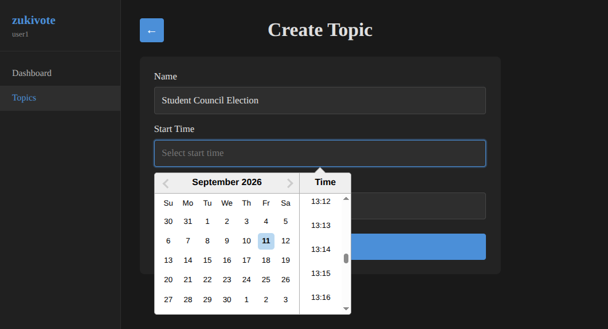
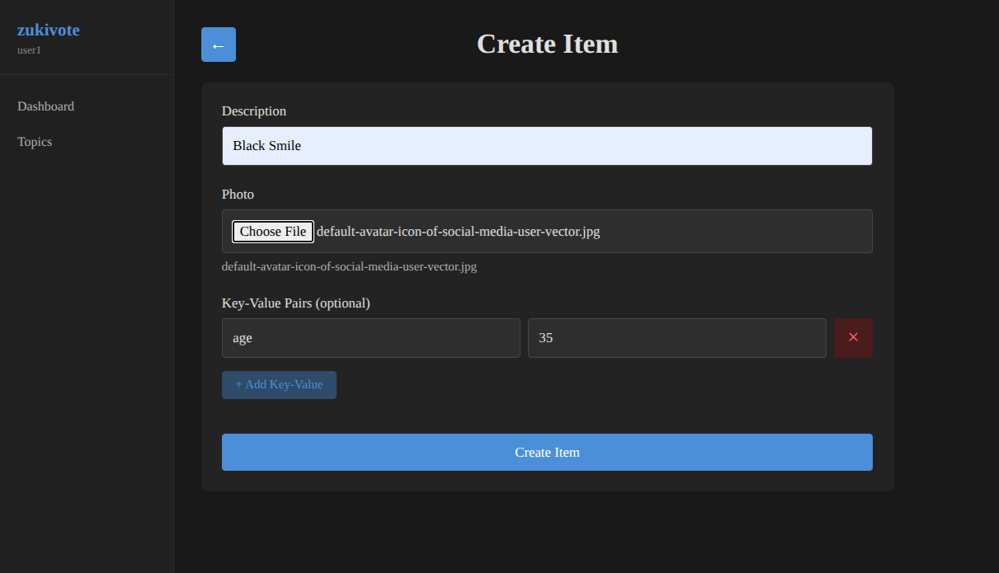
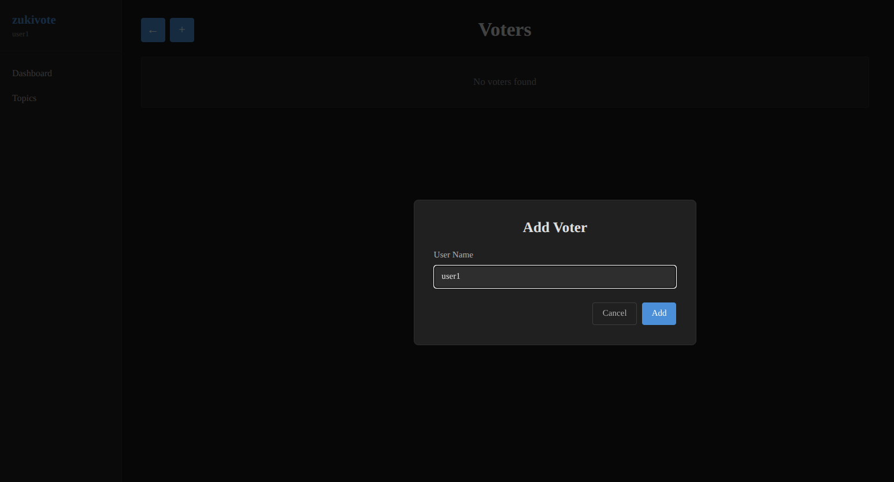
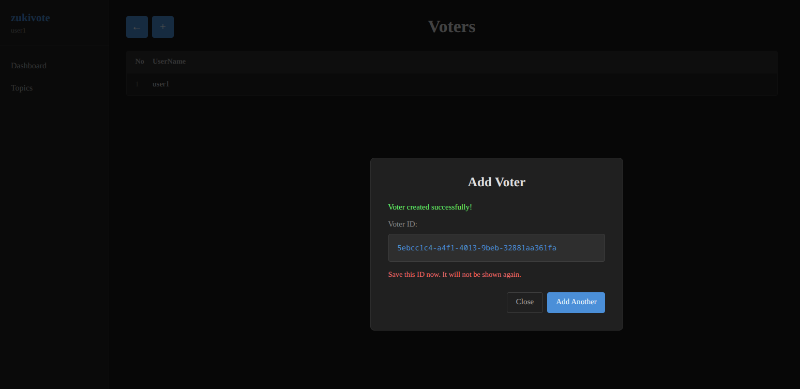
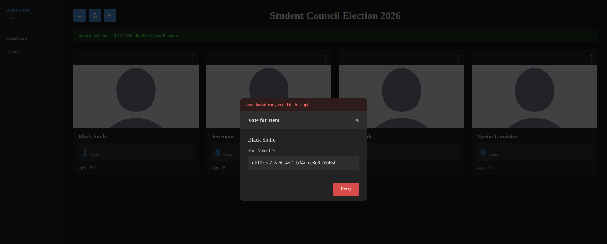
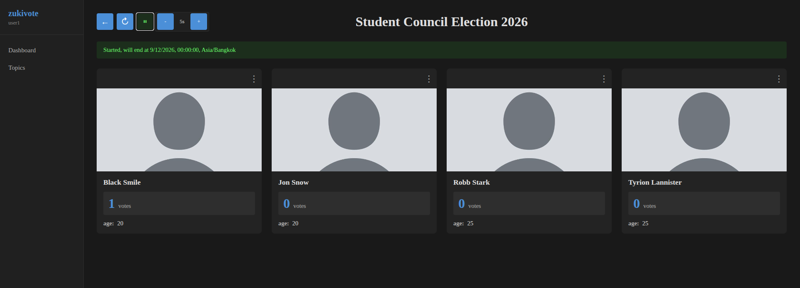

# zukivote

A self-hosted voting application.

## Getting Started

```sh
sudo docker compose up -d
```

The web app will be available at http://localhost/

## User Guide

### 1. Create a New Voting

After logging in, navigate to **Topics** and click **+ Create Topic**. Fill in the topic name, description, and set the start/end times.



### 2. Add Candidates

Go to **Items** for your topic and add the candidates or options that voters can choose from.



### 3. Add Voters

Navigate to **Voters** and add voters by username. Only registered users added here will be eligible to vote.



### 4. Share Voting Keys

Each voter receives a unique voting key. Share the voting link and key with eligible voters.



### 5. Cast Votes

Voters open the voting link, enter their key, and select their preferred candidate.



### 6. View Results

Once voting is active or ended, results are displayed with vote counts for each candidate.

