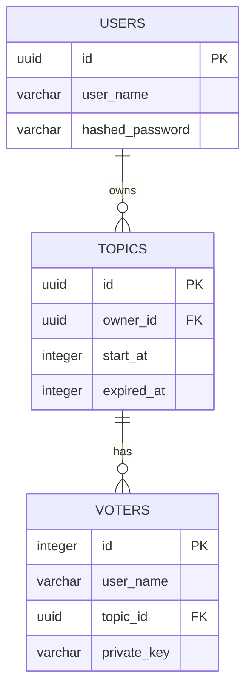

# Database Schema

## ER Diagram

## Tables

### users

| Column           | Type     | Constraints                |
| ---------------- | -------- | -------------------------- |
| id               | UUID     | PRIMARY KEY                |
| user_name        | VARCHAR  | NOT NULL, UNIQUE           |
| hashed_password  | VARCHAR  | NOT NULL                   |

### topics

| Column     | Type     | Constraints                |
| ---------- | -------- | -------------------------- |
| id         | UUID     | PRIMARY KEY                |
| owner_id   | UUID     | FOREIGN KEY references users(id) |
| start_at   | INTEGER  | NOT NULL (unix time)       |
| expired_at | INTEGER  | NOT NULL (unix time)       |

### voters

| Column      | Type     | Constraints                |
| ----------- | -------- | -------------------------- |
| id          | INTEGER  | PRIMARY KEY, AUTO INCREMENT |
| user_name   | VARCHAR  | NOT NULL, UNIQUE           |
| topic_id    | UUID     | FOREIGN KEY references topics(id) |
| private_key | VARCHAR  | NOT NULL                   |
