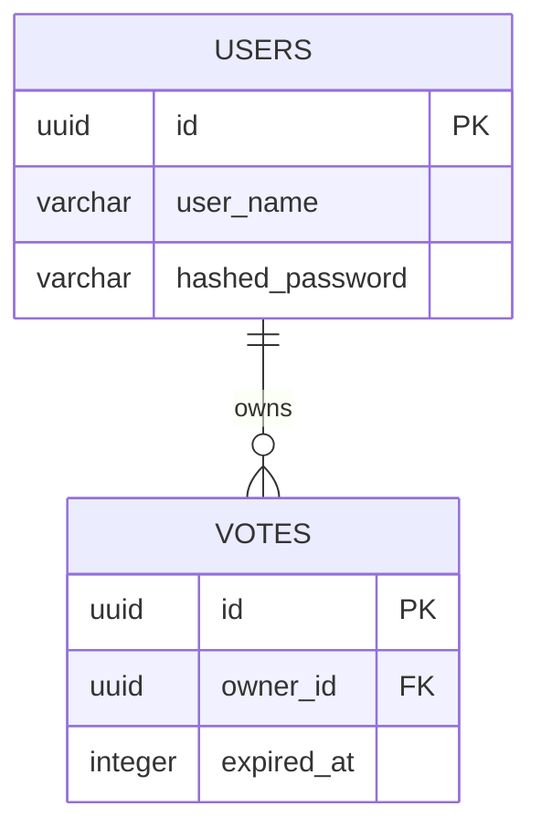

# Database Schema

## ER Diagram

## Tables

### users

| Column           | Type     | Constraints |
| ---------------- | -------- | ----------- |
| id               | UUID     | PRIMARY KEY |
| user_name        | VARCHAR  | NOT NULL    |
| hashed_password  | VARCHAR  | NOT NULL    |

### votes

| Column     | Type     | Constraints                |
| ---------- | -------- | -------------------------- |
| id         | UUID     | PRIMARY KEY                |
| owner_id   | UUID     | FOREIGN KEY references users(id) |
| expired_at | INTEGER  | NOT NULL (unix time)       |
