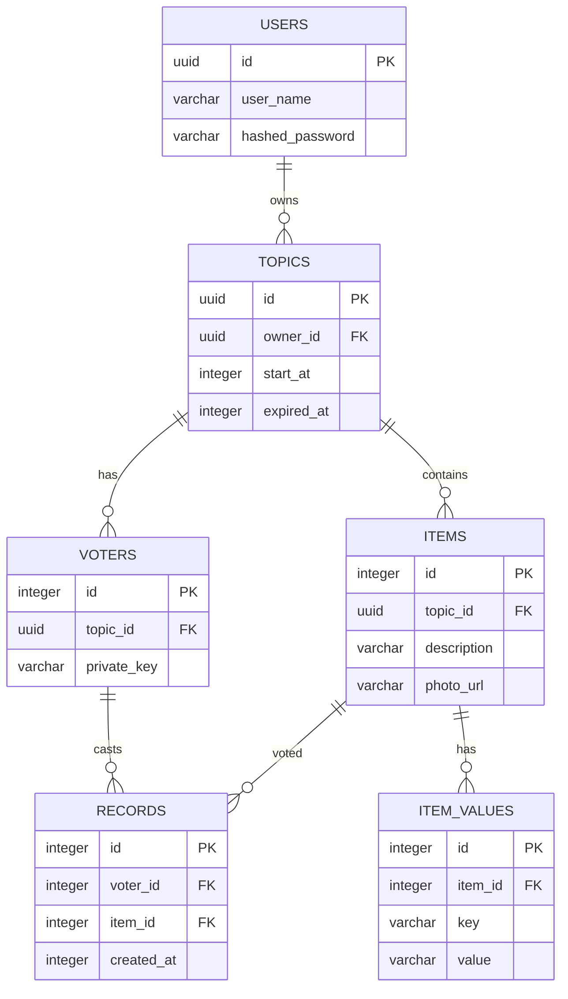

# Database Schema

## ER Diagram

## Tables

### users

| Column           | Type     | Constraints                |
| ---------------- | -------- | -------------------------- |
| id               | UUID     | PRIMARY KEY                |
| user_name        | VARCHAR  | NOT NULL, UNIQUE           |
| hashed_password  | VARCHAR  | NOT NULL                   |

### topics

| Column     | Type     | Constraints                |
| ---------- | -------- | -------------------------- |
| id         | UUID     | PRIMARY KEY                |
| owner_id   | UUID     | FOREIGN KEY references users(id) ON DELETE CASCADE |
| start_at   | INTEGER  | NOT NULL (unix time)       |
| expired_at | INTEGER  | NOT NULL (unix time)       |

### voters

| Column      | Type     | Constraints                |
| ----------- | -------- | -------------------------- |
| id          | INTEGER  | PRIMARY KEY, AUTO INCREMENT |
| topic_id    | UUID     | FOREIGN KEY references topics(id) ON DELETE CASCADE |
| private_key | VARCHAR  | NOT NULL, UNIQUE           |

### items

| Column      | Type     | Constraints                |
| ----------- | -------- | -------------------------- |
| id          | INTEGER  | PRIMARY KEY, AUTO INCREMENT |
| topic_id    | UUID     | FOREIGN KEY references topics(id) ON DELETE CASCADE |
| description | VARCHAR  | NOT NULL                   |
| photo_url   | VARCHAR  |                            |

> `voted_count` is not stored; it is derived as `COUNT(records)` where `records.item_id = items.id`.

### item_values

| Column  | Type     | Constraints                |
| ------- | -------- | -------------------------- |
| id      | INTEGER  | PRIMARY KEY, AUTO INCREMENT |
| item_id | INTEGER  | FOREIGN KEY references items(id) ON DELETE CASCADE |
| key     | VARCHAR  | NOT NULL                   |
| value   | VARCHAR  | NOT NULL                   |

> UNIQUE constraint on `(item_id, key)`.

### records

| Column   | Type     | Constraints                |
| -------- | -------- | -------------------------- |
| id       | INTEGER  | PRIMARY KEY, AUTO INCREMENT |
| voter_id | INTEGER  | FOREIGN KEY references voters(id) ON DELETE CASCADE |
| item_id  | INTEGER  | FOREIGN KEY references items(id) ON DELETE CASCADE |
| created_at | INTEGER | NOT NULL (unix time)           |

> UNIQUE constraint on `(voter_id, item_id)` prevents a voter from voting on the same item more than once.
